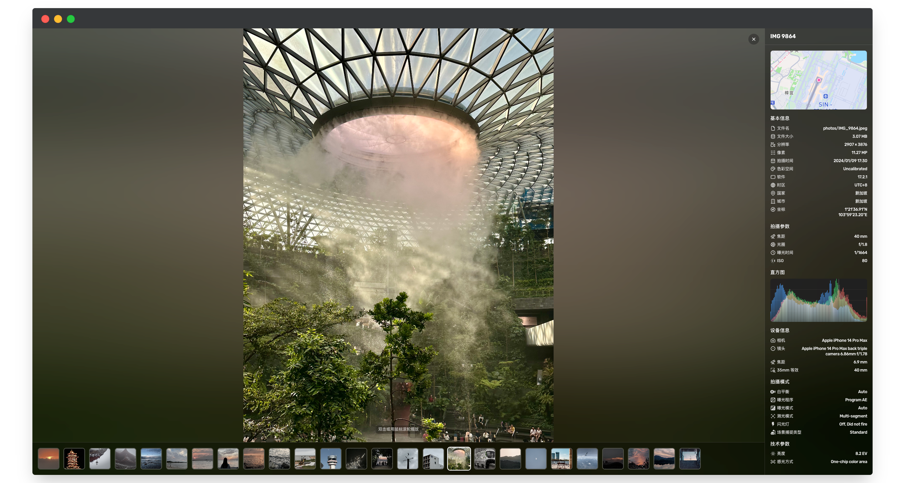
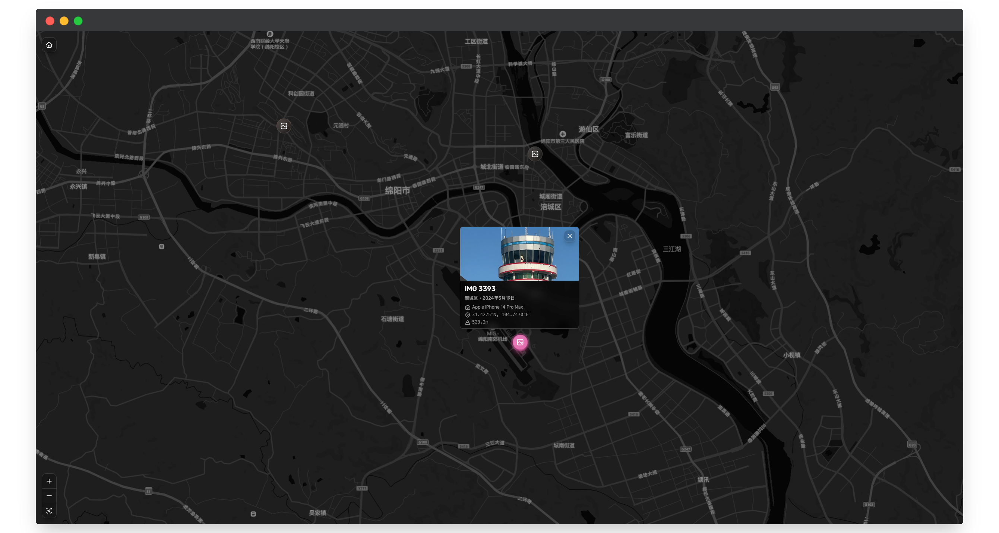
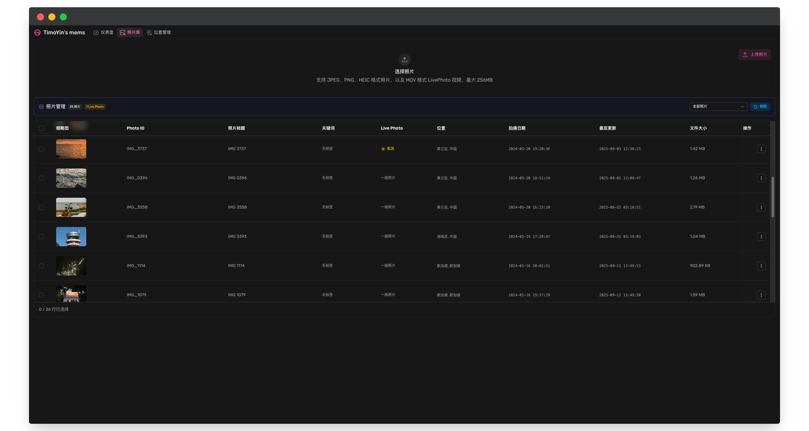

# ChronoFrame

<p align="center">
  
  <br/>
  
  
  
  
</p>

**Languages:** [English](README.md) | 中文

丝滑的照片展示和管理应用，支持多种图片格式和大尺寸图片渲染。

[在线演示: TimoYin's Mems](https://lens.bh8.ga)

## ✨ 特性

### 🖼️ 强大的图片管理

- **在线管理照片** - 通过 Web 界面轻松管理和浏览照片
- **探索地图** - 在地图上浏览照片拍摄位置
- **智能 EXIF 解析** - 自动提取拍摄时间、地理位置、相机参数等元数据
- **地理位置识别** - 自动识别(Reverse Geocoding)照片拍摄地点
- **多格式支持** - 支持 JPEG、PNG、HEIC/HEIF 等主流图片格式
- **智能缩略图** - 基于 ThumbHash 技术的高效缩略图生成

### 🔧 现代技术栈

- **Nuxt 4** - 基于最新的 Nuxt 框架，提供 SSR/SSG 支持
- **TypeScript** - 完整的类型安全保障
- **TailwindCSS** - 现代化的 CSS 框架
- **Drizzle ORM** - 类型安全的数据库 ORM

### ☁️ 灵活的存储方案

- **多存储后端** - 支持 S3 兼容存储、GitHub(WIP)、本地文件系统(WIP) 等
- **CDN 加速** - 可配置 CDN 地址加速图片访问

## 🐳 部署

推荐使用预构建的 docker 镜像部署，[在 ghcr 上查看镜像](https://github.com/HoshinoSuzumi/chronoframe/pkgs/container/chronoframe)

### Docker

修改命令中的环境变量后运行：

```bash
docker run -d \
  --name chronoframe \
  -p 3000:3000 \
  -v $(pwd)/data:/app/data \
  -e CFRAME_ADMIN_EMAIL="" \
  -e CFRAME_ADMIN_NAME="" \
  -e CFRAME_ADMIN_PASSWORD="" \
  -e NUXT_PUBLIC_APP_TITLE="" \
  -e NUXT_PUBLIC_APP_SLOGAN="" \
  -e NUXT_PUBLIC_APP_AVATAR_URL="" \
  -e NUXT_PUBLIC_MAPBOX_ACCESS_TOKEN="" \
  -e NUXT_STORAGE_PROVIDER="s3" \
  -e NUXT_PROVIDER_S3_ENDPOINT="" \
  -e NUXT_PROVIDER_S3_BUCKET="chronoframe" \
  -e NUXT_PROVIDER_S3_REGION="auto" \
  -e NUXT_PROVIDER_S3_ACCESS_KEY_ID="" \
  -e NUXT_PROVIDER_S3_SECRET_ACCESS_KEY="" \
  -e NUXT_PROVIDER_S3_PREFIX="photos/" \
  -e NUXT_PROVIDER_S3_CDN_URL="" \
  -e NUXT_OAUTH_GITHUB_CLIENT_ID="" \
  -e NUXT_OAUTH_GITHUB_CLIENT_SECRET="" \
  -e NUXT_SESSION_PASSWORD="" \
  ghcr.io/hoshinosuzumi/chronoframe:latest
```

### Docker Compose

创建 `.env` 文件

```env
# Admin user email (required)
CFRAME_ADMIN_EMAIL=
# Admin user name (default to Chronoframe, optional)
CFRAME_ADMIN_NAME=
# Admin user password (default to CF1234@!, optional)
CFRAME_ADMIN_PASSWORD=

# 应用标题与口号
NUXT_PUBLIC_APP_TITLE=
NUXT_PUBLIC_APP_SLOGAN=
NUXT_PUBLIC_APP_AVATAR_URL=

# Mapbox Token
NUXT_PUBLIC_MAPBOX_ACCESS_TOKEN=

# 存储提供者（s3/github/local）
NUXT_STORAGE_PROVIDER=s3
# S3 存储服务配置
NUXT_PROVIDER_S3_ENDPOINT=
NUXT_PROVIDER_S3_BUCKET=chronoframe
NUXT_PROVIDER_S3_REGION=auto
NUXT_PROVIDER_S3_ACCESS_KEY_ID=
NUXT_PROVIDER_S3_SECRET_ACCESS_KEY=
NUXT_PROVIDER_S3_PREFIX=photos/
NUXT_PROVIDER_S3_CDN_URL=

# 会话密码（32 位随机字符串，必须设置）
NUXT_SESSION_PASSWORD=

# GitHub OAuth
NUXT_OAUTH_GITHUB_CLIENT_ID=
NUXT_OAUTH_GITHUB_CLIENT_SECRET=

```

创建 `docker-compose.yml`：

```yaml
services:
  chronoframe:
    image: ghcr.io/hoshinosuzumi/chronoframe:latest
    container_name: chronoframe
    restart: unless-stopped
    ports:
      - '3000:3000'
    volumes:
      - ./data:/app/data
    env_file:
      - .env
```

启动：

```bash
docker-compose up -d
```

### 环境变量列表

| 环境变量                           | 说明                                     | 默认值      | 必需                                      |
| :--------------------------------- | :--------------------------------------- | :---------- | :---------------------------------------- |
| CFRAME_ADMIN_EMAIL                 | 初始管理员用户的邮箱                     | 无          | 是，填写登录使用的 GitHub 账户的邮箱      |
| CFRAME_ADMIN_NAME                  | 初始管理员用户的用户名                   | Chronoframe | 否                                        |
| CFRAME_ADMIN_PASSWORD              | 初始管理员用户的密码                     | CF1234@!    | 否                                        |
| NUXT_PUBLIC_APP_TITLE              | 应用标题                                 | ChronoFrame | 否                                        |
| NUXT_PUBLIC_APP_SLOGAN             | 应用口号                                 | 无          | 否                                        |
| NUXT_PUBLIC_APP_AVATAR_URL         | 应用头像 URL                             | 无          | 否                                        |
| NUXT_PUBLIC_MAPBOX_ACCESS_TOKEN    | Mapbox 访问令牌，用于地图服务            | 无          | 是                                        |
| NUXT_STORAGE_PROVIDER              | 存储提供者，支持 `s3`、`github`、`local` | `s3`        | 是                                        |
| NUXT_PROVIDER_S3_ENDPOINT          | S3 兼容存储服务的 Endpoint               | 无          | 当 `NUXT_STORAGE_PROVIDER` 为 `s3` 时必需 |
| NUXT_PROVIDER_S3_BUCKET            | S3 存储桶名称                            | chronoframe | 当 `NUXT_STORAGE_PROVIDER` 为 `s3` 时必需 |
| NUXT_PROVIDER_S3_REGION            | S3 存储桶区域                            | auto        | 当 `NUXT_STORAGE_PROVIDER` 为 `s3` 时必需 |
| NUXT_PROVIDER_S3_ACCESS_KEY_ID     | S3 访问密钥 ID                           | 无          | 当 `NUXT_STORAGE_PROVIDER` 为 `s3` 时必需 |
| NUXT_PROVIDER_S3_SECRET_ACCESS_KEY | S3 访问密钥                              | 无          | 当 `NUXT_STORAGE_PROVIDER` 为 `s3` 时必需 |
| NUXT_PROVIDER_S3_PREFIX            | S3 存储前缀                              | photos/     | 否                                        |
| NUXT_PROVIDER_S3_CDN_URL           | S3 存储的 CDN 地址                       | 无          | 否                                        |
| NUXT_OAUTH_GITHUB_CLIENT_ID        | GitHub OAuth 应用的 Client ID            | 无          | 是                                        |
| NUXT_OAUTH_GITHUB_CLIENT_SECRET    | GitHub OAuth 应用的 Client Secret        | 无          | 是                                        |
| NUXT_SESSION_PASSWORD              | 用于加密会话的密码，32 位随机字符串      | 无          | 是                                        |

## 📖 使用指南

> 如未配置 `CFRAME_ADMIN_EMAIL` 和 `CFRAME_ADMIN_PASSWORD`，默认账号如下：
> - 邮箱: `admin@chronoframe.com`
> - 密码: `CF1234@!`

### 登录到控制台
1. 点击头像跳转到登录页面，可以使用账号密码或 GitHub 登录

### 上传照片
1. 访问仪表板页面 `/dashboard`
2. 在 `Photos` 页面中选择图片并点击上传（支持批量上传和拖拽上传）
3. 系统将自动提取 EXIF 信息、生成缩略图并逆编码照片地理位置

## 📸 截图






## 🛠️ 开发

### 环境要求

- Node.js 18+
- pnpm 9.0+

### 安装依赖

```bash
# 使用 pnpm (推荐)
pnpm install

# 或使用其他包管理器
npm install
yarn install
```

### 配置环境变量

复制环境变量模板并根据需要配置：

```bash
cp .env.example .env
```

### 数据库初始化

```bash
# 2. 生成数据库迁移文件(可选)
pnpm db:generate

# 3. 执行数据库迁移
pnpm db:migrate
```

### 启动开发服务器

```bash
pnpm dev
```

应用将在 `http://localhost:3000` 启动。

### 项目结构

```
chronoframe/
├── app/                    # Nuxt 应用
│   ├── components/         # 组件
│   ├── pages/              # 页面路由
│   ├── composables/        # 组合式函数
│   └── stores/             # Pinia 状态管理
├── packages/
│   └── webgl-image/        # WebGL 图片查看器
├── server/
│   ├── api/                # API 路由
│   ├── database/           # 数据库 schema 和迁移
│   └── services/           # 业务逻辑服务
└── shared/                 # 共享类型和工具
```

### 构建命令

```bash
# 开发模式 (包含依赖包构建)
pnpm dev

# 仅构建依赖包
pnpm build:deps

# 构建生产版本
pnpm build

# 数据库操作
pnpm db:generate    # 生成迁移文件
pnpm db:migrate     # 执行迁移

# 预览生产版本
pnpm preview
```

## 🤝 贡献

欢迎贡献代码！请确保：

1. Fork 本仓库
2. 创建功能分支 (`git checkout -b feature/amazing-feature`)
3. 提交更改 (`git commit -m 'Add some amazing feature'`)
4. 推送到分支 (`git push origin feature/amazing-feature`)
5. 开启 Pull Request

### 开发规范

- 使用 TypeScript 进行类型安全的开发
- 遵循 ESLint 和 Prettier 代码规范
- 更新相关文档

## 📄 许可证

本项目基于 [MIT 许可证](LICENSE) 开源。

## 👤 作者

**Timothy Yin**

- Email: master@uniiem.com
- GitHub: [@HoshinoSuzumi](https://github.com/HoshinoSuzumi)
- Website: [bh8.ga](https://bh8.ga)
- Gallery: [lens.bh8.ga](https://lens.bh8.ga)

## ❓ FAQ

<details>
  <summary>如何创建管理员用户？</summary>
  <p>
    首次启动时，会根据环境变量 <code>CFRAME_ADMIN_EMAIL</code>、<code>CFRAME_ADMIN_NAME</code> 和 <code>CFRAME_ADMIN_PASSWORD</code> 环境变量创建一个管理员用户。<code>CFRAME_ADMIN_EMAIL</code> 必须是登录使用的 GitHub 账户的邮箱。
  </p>
</details>
<details>
  <summary>支持哪些图片格式？</summary>
  <p>
    支持 JPEG、PNG、HEIC/HEIF、MOV(作为实况照片) 格式。
  </p>
</details>
<details>
  <summary>为什么无法使用 GitHub/Local 存储？</summary>
  <p>
    目前支持 S3 兼容存储，未来计划支持 GitHub 和本地文件系统存储。
  </p>
</details>
<details>
  <summary>为什么需要/如何配置地图服务？</summary>
  <p>
    地图服务用于在地图上浏览照片拍摄位置，以及照片详情中的小地图渲染。目前使用 Mapbox，注册后<a href="https://console.mapbox.com/account/access-tokens/">获取访问令牌</a>并配置到 <code>MAPBOX_TOKEN</code> 环境变量中。
  </p>
</details>
<details>
  <summary>为什么我上传的 MOV 文件没有被识别为实况照片？</summary>
  <p>
    需要确保实况照片对的图片(.heic)和视频(.mov)的文件名一致（例如 <code>IMG_1234.heic</code> 与 <code>IMG_1234.mov</code> 会自动匹配）。
    一般情况来说，不管是上传 .heic 还是 .mov，都会检测一次配对，因此上传的顺序无关紧要。
    如果仍然没有被识别为实况照片，请在仪表盘中找到图片，在操作菜单中手动触发配对检测。
  </p>
</details>
<details>
  <summary>如何导入存储中已有的照片？</summary>
  <p>
    目前不支持直接导入已有照片，未来计划支持通过指定目录扫描导入。
  </p>
</details>
<details>
  <summary>本项目与 Afilmory 有何区别？</summary>
  <p>
    Afilmory 是一个非常优秀的项目，其部署方式是在本地或 CI 中处理存储中的照片并生成清单文件，然后前端通过读取清单文件来展示照片，属于静态部署。
    ChronoFrame 则是一个动态的照片管理应用，提供在线上传、管理和浏览照片的功能，适合需要频繁更新照片的场景。
  </p>
</details>

## 🙏 致谢

本项目受启发于 [Afilmory](https://github.com/Afilmory/afilmory)，同样优秀的个人相册项目。

感谢以下优秀的开源项目和库：

- [Nuxt](https://nuxt.com/)
- [TailwindCSS](https://tailwindcss.com/)
- [Drizzle ORM](https://orm.drizzle.team/)

## ⭐️ Stargazers

[](https://starchart.cc/HoshinoSuzumi/chronoframe)
